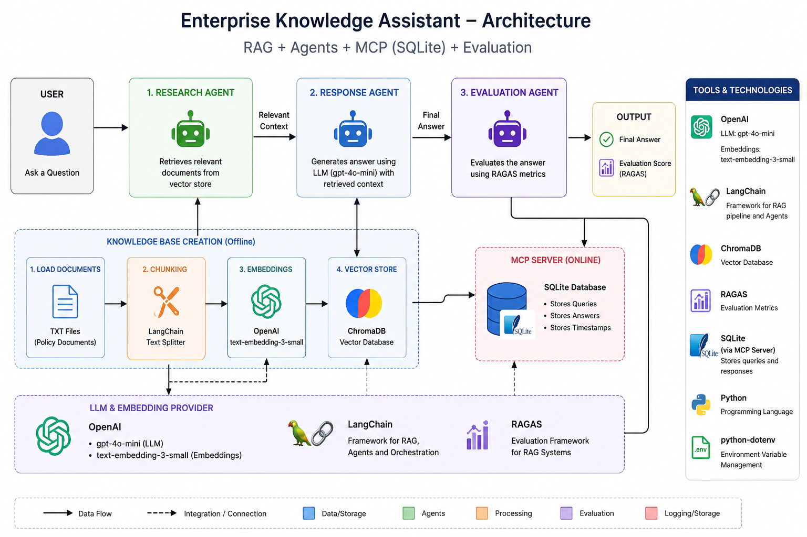

# 🚀 Enterprise Knowledge Assistant

### 🚀 Built using CrewAI, RAG, RAGAS and MCP

---

## 📌 Project Title

Enterprise Knowledge Assistant using CrewAI, Retrieval-Augmented Generation (RAG), RAGAS Evaluation, and MCP Integration

---

## 🧠 Project Description

Organizations manage large volumes of distributed knowledge across documents, policies, internal systems, and databases. Searching for relevant information manually is slow and inefficient.

This project builds an **Agentic AI-powered Enterprise Knowledge Assistant** that:

- Retrieves enterprise knowledge using **RAG (Retrieval Augmented Generation)**
- Generates intelligent responses using **CrewAI multi-agent system**
- Evaluates response quality using **RAGAS metrics**
- Logs interactions using **MCP (SQLite Model Context Protocol Server)**

It demonstrates a complete **end-to-end Agentic AI architecture** with retrieval, reasoning, evaluation, and memory.

---

## 📌 Architecture



---

## 🔄 Workflow

1. User enters a query
2. Research Agent retrieves relevant context from vector DB
3. Response Agent generates answer using retrieved context
4. Evaluation Agent evaluates response using RAGAS metrics
5. MCP Server logs query and response
6. Final output + evaluation scores are displayed

### User -> RAG -> CrewAI Agents -> LLM -> RAGAS -> Output

---

## 📚 RAG Design

### 📂 Data Source

- Internal enterprise documents (text files)

### ✂️ Chunking Strategy

- Documents split into smaller semantic chunks
- Each chunk represents a retrievable knowledge unit

### 🔢 Embedding Model

- OpenAI Embeddings: `text-embedding-3-small`

### 🗄️ Vector Database

- ChromaDB (in-memory / persistent)

### 🔍 Retrieval Strategy

- Top-K similarity search (K = 3)
- Cosine similarity-based retrieval

---

## 🤖 CrewAI Design

### 👥 Agents

#### 1. Research Agent

- Retrieves relevant context from vector database
- Performs semantic search over embeddings

#### 2. Response Generation Agent

- Uses retrieved context + user query
- Generates final response using LLM

#### 3. Evaluation Agent

- Evaluates response using RAGAS framework
- Computes quality metrics

---

### 🔁 Agent Workflow

- Research Agent → Response Agent → Evaluation Agent

---

## 🔗 MCP Integration

### 🗄️ MCP Server Used

- SQLite MCP Server

### 📌 Purpose

- Stores all user queries and responses
- Maintains interaction history
- Enables auditability and traceability

### ⚙️ Functionality

- Logs every query-response pair
- Stores structured conversation history

---

## 📊 RAGAS Evaluation

### 📌 Metrics Used

#### 1. Faithfulness

Measures how factually consistent the answer is with retrieved context.

#### 2. Answer Relevancy

Measures how relevant the generated answer is to the query.

#### 3. Context Precision

Measures accuracy of retrieved context.

#### 4. Context Recall

Measures completeness of retrieved context.

---

### 📈 Sample Output

Faithfulness : 0.91
Answer Relevancy : 0.88
Context Precision : 0.85
Context Recall : 0.82

---

### 🧠 Interpretation

- Scores > 0.8 indicate strong system performance
- Helps identify weak retrieval or generation stages
- Enables continuous RAG optimization

---

## 🛠️ Tech Stack

- Python
- OpenAI (gpt-4o-mini)
- LangChain
- ChromaDB
- CrewAI
- RAGAS

---

## ⚙️ Setup Instructions

Follow these steps to set up and run the project locally.

---

### 1️⃣ Clone the Repository

```bash
git clone <repo-link>
cd enterprise-knowledge-assistant
```

### 2️⃣ Create Virtual Environment

```bash
python -m venv venv
```

### Activate the environment:

```bash
venv\Scripts\activate
```

### 3️⃣ Install Dependencies

```bash
pip install -r requirements.txt
```

### 4️⃣ Set Environment Variables

```bash
touch .env
```

### 5️⃣ Initialize the System

```bash
python main.py
```
